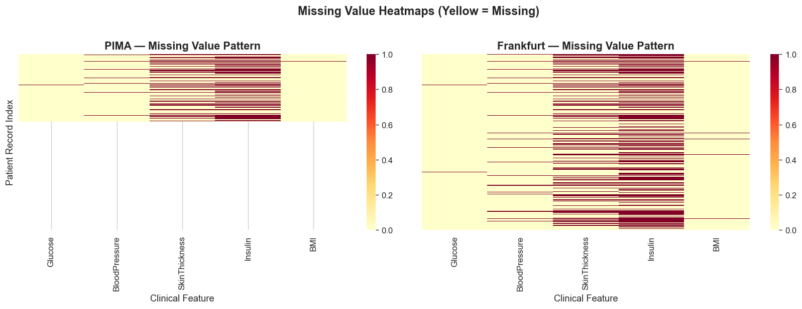
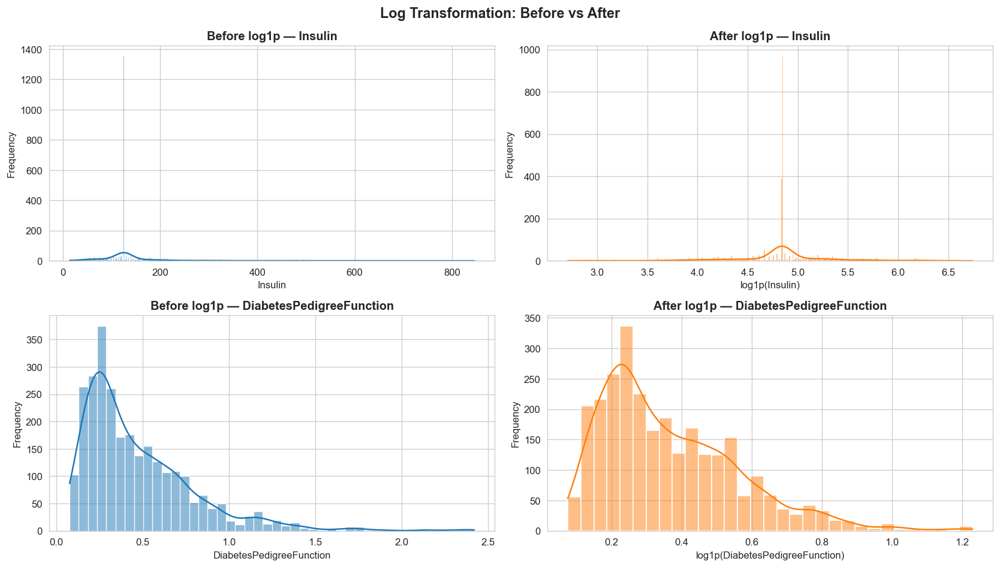
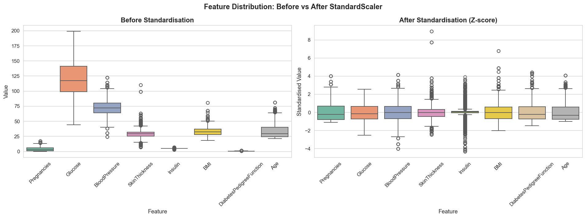
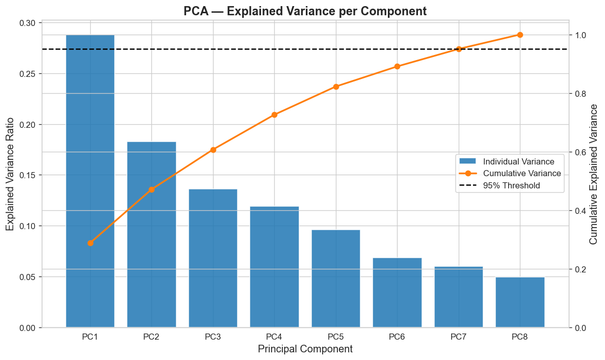
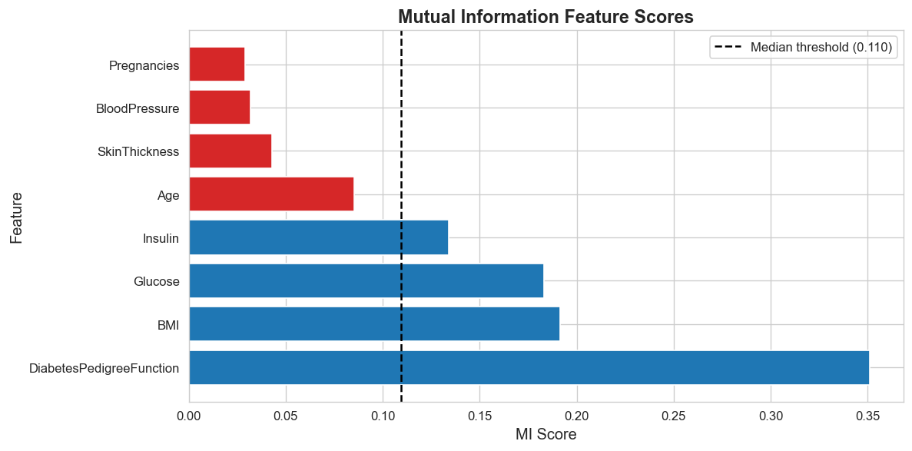
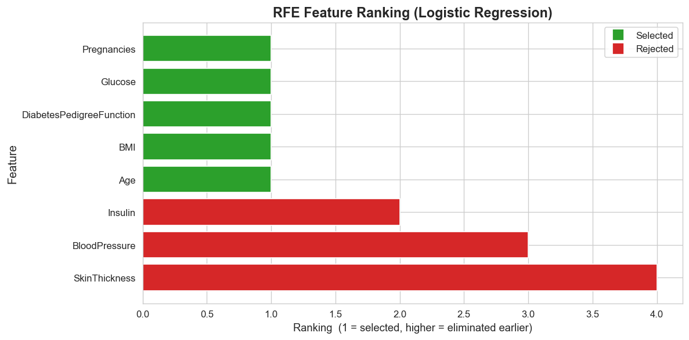
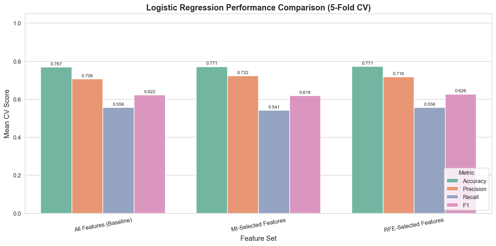

# Universiti Kebangsaan Malaysia

**TC6414 | Data Knowledge Discovery & Data Mining**

**Assignment 1 | Data Preprocessing and Feature Selection**

**Lecturer:** Assoc. Prof. Dr. Zalinda Othman

**Student Name:** ZHANG CHENCHUAN

**Matrix NO:** P162614

**Date:** April 2026

```{=openxml}
<w:p><w:r><w:br w:type="page"/></w:r></w:p>
```

# 1.0 INTRODUCTION

## 1.1 Background and Objectives

Diabetes mellitus is a major global health problem because it is chronic, progressive, and associated with severe complications when it is not detected early. Machine learning provides a useful decision-support approach because routine clinical variables such as glucose level, body mass index, age, insulin, and blood pressure can be analysed together to estimate diabetes risk. Previous studies show that predictive modelling for diabetes depends strongly on careful data preprocessing because raw medical data often include missing, noisy, and unevenly scaled measurements (Olisah et al., 2022; Tasin et al., 2023).

The objective of this study is to apply data preprocessing and feature selection to two diabetes datasets, namely the Pima Indians Diabetes Database and the Frankfurt Hospital Diabetes Dataset. The prepared dataset is then used for Logistic Regression classification. This workflow follows the view that effective diabetes classification requires appropriate cleaning, transformation, standardization, dimensionality reduction, and feature selection before model evaluation (Chang et al., 2023).

# 2.0 DATA ACQUISITION

## 2.1 Dataset Overview

Dataset A is the Pima Indians Diabetes Database, a widely used binary classification dataset from UCI/Kaggle. It contains 768 records and 9 columns: eight clinical attributes and one target variable, `Outcome`, where 0 indicates no diabetes and 1 indicates diabetes.

```
PIMA dataset information
RangeIndex: 768 entries, 0 to 767
Data columns (total 9 columns):
 #   Column                    Non-Null Count  Dtype
 0   Pregnancies               768 non-null    int64
 1   Glucose                   768 non-null    int64
 2   BloodPressure             768 non-null    int64
 3   SkinThickness             768 non-null    int64
 4   Insulin                   768 non-null    int64
 5   BMI                       768 non-null    float64
 6   DiabetesPedigreeFunction  768 non-null    float64
 7   Age                       768 non-null    int64
 8   Outcome                   768 non-null    int64
dtypes: float64(2), int64(7)
```

**Figure 2.1.1** Mental health information displayed about features or attributes utilized in the dataset

Dataset B is the Frankfurt Hospital Diabetes Dataset obtained from a public GitHub source. It uses the same nine-column structure as the PIMA dataset and contains 2,000 records. Because both datasets share the same attributes, they can be integrated directly after missing value handling.

```
Frankfurt dataset information
RangeIndex: 2000 entries, 0 to 1999
Data columns (total 9 columns):
 #   Column                    Non-Null Count  Dtype
 0   Pregnancies               2000 non-null   int64
 1   Glucose                   2000 non-null   int64
 2   BloodPressure             2000 non-null   int64
 3   SkinThickness             2000 non-null   int64
 4   Insulin                   2000 non-null   int64
 5   BMI                       2000 non-null   float64
 6   DiabetesPedigreeFunction  2000 non-null   float64
 7   Age                       2000 non-null   int64
 8   Outcome                   2000 non-null   int64
dtypes: float64(2), int64(7)
```

**Figure 2.1.2** Frankfurt dataset information displayed about features or attributes utilized in the dataset

Both datasets contained zeros in clinical columns where a true zero value is medically implausible. Therefore, zeros in `Glucose`, `BloodPressure`, `SkinThickness`, `Insulin`, and `BMI` were treated as missing values.

## 2.2 Tools and Libraries Used

The analysis was implemented in Python using a runnable Jupyter Notebook suitable for Google Colab. Pandas was used for data manipulation, NumPy for numerical operations, Scikit-learn for preprocessing, feature selection, dimensionality reduction, and modelling, while Matplotlib and Seaborn were used for visualization.

# 3.0 DATA PREPARATION

Data preparation is the process of converting raw data into a consistent, reliable, and model-ready format. In medical prediction tasks, this stage is especially important because missing values, skewed distributions, different measurement scales, and redundant variables can distort the learning process and reduce model reliability. The preparation steps in this study follow common preprocessing practice for healthcare machine learning pipelines (Li et al., 2023).

## 3.1 Handling Missing Values

Zeros in the five selected clinical attributes were interpreted as missing data because a glucose level, blood pressure, skin thickness, insulin value, or BMI of zero is not clinically meaningful for living patients. After replacing these zeros with `NaN`, the missingness pattern was visualized for both datasets.

{width=5.6in}

**Figure 3.1.1** Missing value heatmap for PIMA and Frankfurt datasets

| Attribute | PIMA missing before imputation | Frankfurt missing before imputation | PIMA missing after imputation | Frankfurt missing after imputation |
|---|---:|---:|---:|---:|
| Glucose | 5 | 13 | 0 | 0 |
| BloodPressure | 35 | 90 | 0 | 0 |
| SkinThickness | 227 | 573 | 0 | 0 |
| Insulin | 374 | 956 | 0 | 0 |
| BMI | 11 | 28 | 0 | 0 |

Median imputation was used separately for each dataset. The median was chosen because it is more robust than the mean when medical variables contain outliers or skewed distributions. This was especially relevant for insulin and skin thickness, where missingness was comparatively high.

## 3.2 Data Integration

The PIMA and Frankfurt datasets were combined to improve population diversity by joining data from a United States-based dataset and a Germany-based hospital dataset. A `source` column was added before merging so that the contribution of each dataset could be checked after concatenation.

The integrated dataset contained 2,768 rows and 10 columns before dropping the temporary `source` column. The source distribution was 768 records from PIMA and 2,000 records from Frankfurt. The class distribution after integration was 1,816 records for Outcome 0 and 952 records for Outcome 1.

## 3.3 Data Transformation

Logarithmic transformation using `np.log1p()` was applied to `Insulin` and `DiabetesPedigreeFunction`. This transformation reduces right-skewness while preserving zero-compatible computation, which makes the distributions more suitable for linear modelling.

{width=5.6in}

**Figure 3.3.1** Before and after log transformation for Insulin and Diabetes Pedigree Function

## 3.4 Data Standardization

Standardization was performed using Scikit-learn's `StandardScaler`, which converts each feature into a Z-score with mean approximately 0 and standard deviation approximately 1. This step was required because the attributes used different scales, for example glucose and insulin are much larger numerically than diabetes pedigree function.

{width=5.6in}

**Figure 3.4.1** Boxplot comparison before and after standardization

## 3.5 Dimensionality Reduction

Principal Component Analysis was used to examine how much variance could be represented by a smaller set of components. PCA was used for analysis only; the original scaled features were retained for the feature selection stage so that the selected variables remained clinically interpretable.

{width=5.3in}

**Figure 3.5.1** PCA individual and cumulative explained variance

Seven principal components were needed to explain at least 95% of the variance. The cumulative variance reached 0.9507 at PC7, showing that most information was retained only after keeping nearly all original dimensions.

# 4.0 FEATURE SELECTION

## 4.1 Feature Selection Overview

Feature selection aims to identify the most relevant predictors, reduce noise, simplify the model, and improve generalization. Two methods were used: Mutual Information and Recursive Feature Elimination. Mutual Information evaluates dependency between each feature and the target, while RFE repeatedly removes weaker features using a predictive estimator. These methods are commonly used in diabetes prediction workflows to compare statistical relevance and model-based relevance (Olisah et al., 2022).

## 4.2 Mutual Information

Mutual Information measures how much knowing a feature reduces uncertainty about the target variable. Higher scores indicate stronger dependency between the feature and diabetes outcome. Features above the median MI score were selected.

| Rank | Feature | MI Score |
|---:|---|---:|
| 1 | DiabetesPedigreeFunction | 0.3510 |
| 2 | BMI | 0.1914 |
| 3 | Glucose | 0.1831 |
| 4 | Insulin | 0.1342 |
| 5 | Age | 0.0851 |
| 6 | SkinThickness | 0.0430 |
| 7 | BloodPressure | 0.0317 |
| 8 | Pregnancies | 0.0291 |

**Figure 4.2.1.1** Mutual Information scores table

{width=5.2in}

**Figure 4.2.1.2** Mutual Information feature score bar chart

The selected MI features were `DiabetesPedigreeFunction`, `BMI`, `Glucose`, and `Insulin`. These features were selected because their MI scores were above the median threshold of 0.1096.

## 4.3 Recursive Feature Elimination (RFE)

Recursive Feature Elimination was implemented using Logistic Regression as the base estimator with `n_features_to_select = 5`. RFE iteratively removes the least useful variables until the required number of predictors remains.

| Feature | Selected | Ranking |
|---|---|---:|
| Age | True | 1 |
| BMI | True | 1 |
| DiabetesPedigreeFunction | True | 1 |
| Glucose | True | 1 |
| Pregnancies | True | 1 |
| Insulin | False | 2 |
| BloodPressure | False | 3 |
| SkinThickness | False | 4 |

**Figure 4.3.1.1** RFE feature ranking table

{width=5.2in}

**Figure 4.3.1** RFE ranking chart

The five selected RFE features were `Age`, `BMI`, `DiabetesPedigreeFunction`, `Glucose`, and `Pregnancies`.

## 4.4 Comparison of MI and RFE

| Method | Selected features | Overlap |
|---|---|---|
| Mutual Information | DiabetesPedigreeFunction, BMI, Glucose, Insulin | DiabetesPedigreeFunction, BMI, Glucose |
| RFE | Age, BMI, DiabetesPedigreeFunction, Glucose, Pregnancies | DiabetesPedigreeFunction, BMI, Glucose |

Both methods agreed on `DiabetesPedigreeFunction`, `BMI`, and `Glucose`, suggesting that these variables were consistently important. MI additionally selected `Insulin`, while RFE selected `Age` and `Pregnancies`, showing that the filter method emphasized individual dependency and the wrapper method emphasized contribution within Logistic Regression.

# 5.0 MODEL PERFORMANCE ANALYSIS

## 5.1 Baseline Model

The baseline Logistic Regression model used all eight standardized features with 5-fold cross-validation. It achieved Accuracy = 0.7673, Precision = 0.7059, Recall = 0.5557, and F1 = 0.6216.

## 5.2 After MI Feature Selection

The MI-selected model used `DiabetesPedigreeFunction`, `BMI`, `Glucose`, and `Insulin`. It achieved Accuracy = 0.7706, Precision = 0.7222, Recall = 0.5410, and F1 = 0.6180. This improved accuracy and precision compared with the baseline, although recall and F1 were slightly lower.

## 5.3 After RFE Feature Selection

The RFE-selected model used `Age`, `BMI`, `DiabetesPedigreeFunction`, `Glucose`, and `Pregnancies`. It achieved Accuracy = 0.7713, Precision = 0.7163, Recall = 0.5557, and F1 = 0.6257. This was the best overall result because it produced the highest accuracy and F1 score.

## 5.4 Performance Comparison

{width=5.6in}

**Figure 5.1** Logistic Regression performance comparison before and after feature selection

| Scenario | Accuracy | Precision | Recall | F1 |
|---|---:|---:|---:|---:|
| All features | 0.7673 | 0.7059 | 0.5557 | 0.6216 |
| MI-selected features | 0.7706 | 0.7222 | 0.5410 | 0.6180 |
| RFE-selected features | 0.7713 | 0.7163 | 0.5557 | 0.6257 |

Feature selection slightly improved performance compared with the baseline. RFE performed best overall because it achieved the highest accuracy and F1 score while keeping only five predictors. MI produced the highest precision, but its lower recall reduced its F1 score.

# 6.0 CONCLUSION

## 6.1 Summary of Findings

This study prepared two diabetes datasets through missing value treatment, dataset integration, log transformation, feature standardization, PCA analysis, and feature selection. Median imputation removed missing values caused by invalid clinical zeros, log transformation reduced skewness in insulin and diabetes pedigree function, and standardization placed all predictors on a comparable scale.

The feature selection results showed that `DiabetesPedigreeFunction`, `BMI`, and `Glucose` were selected by both MI and RFE. Based on the model results, RFE gave the best performance with Accuracy = 0.7713 and F1 = 0.6257, while MI gave the highest precision at 0.7222.

## 6.2 Limitations and Future Work

One limitation is that the PIMA dataset is limited to female patients, which may reduce generalizability to broader populations. Another limitation is that Logistic Regression is a simple linear classifier and may not capture complex nonlinear relationships in diabetes risk. Future work should compare more advanced models such as Random Forest and XGBoost, and should test other feature selection methods to verify whether the selected predictors remain stable.

# REFERENCES

Ahmed, A., Aziz, S., & Qidwai, U. (2025). Machine Learning Algorithm-Based Prediction of Diabetes Among Female Population Using PIMA Dataset. *Healthcare, 13*(1), 37. https://doi.org/10.3390/healthcare13010037

Chang, V., Bailey, J., Xu, Q. A., & Sun, Z. (2023). Pima Indians diabetes mellitus classification based on machine learning (ML) algorithms. *Neural Computing and Applications, 35*(22), 16157-16173. https://doi.org/10.1007/s00521-022-07049-z

Iparraguirre-Villanueva, O., Espinola-Linares, K., Castaneda, R. O. F., & Cabanillas-Carbonell, M. (2023). Application of Machine Learning Models for Early Detection and Accurate Classification of Type 2 Diabetes. *Diagnostics, 13*(14), 2383. https://doi.org/10.3390/diagnostics13142383

Olisah, C. C., Smith, L., & Smith, M. (2022). Diabetes mellitus prediction and diagnosis from a data preprocessing and machine learning perspective. *Computer Methods and Programs in Biomedicine, 220*, 106773. https://doi.org/10.1016/j.cmpb.2022.106773

Reza, M. S., Amin, R., Yasmin, R., Kulsum, W., & Ruhi, S. (2024). Improving diabetes disease patients classification using stacking ensemble method with PIMA and local healthcare data. *Heliyon, 10*(2), e24536. https://doi.org/10.1016/j.heliyon.2024.e24536

Tasin, I., Nabil, T. U., Islam, S., & Khan, R. (2023). Diabetes prediction using machine learning and explainable AI techniques. *Healthcare Technology Letters, 10*(1-2), 1-10. https://doi.org/10.1049/htl2.12039
